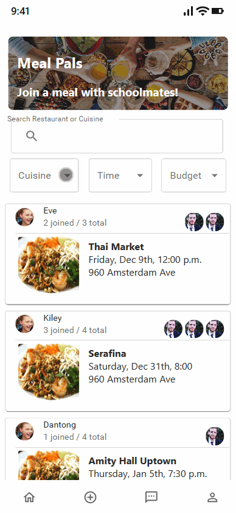

# Meal-Pals-UI-Design

This project was A design solution for users to discover, participate in, publish and organize meals with other CU students. 


## React version
react: 18.2.0  

## Team members
| Name      | Uni |
| ----------- | ----------- |
| Aparna Kumar    | ak4605       |
| Yiyi Jiang   | yj2729       |
| Kiley Matschke   | km3496        |
| Dantong Zhu   | dz2451        |


### Usage

```shell
npm install
npm run start
```

### Demo

